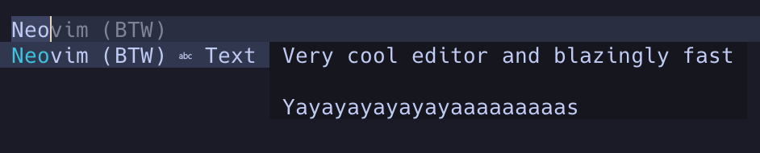
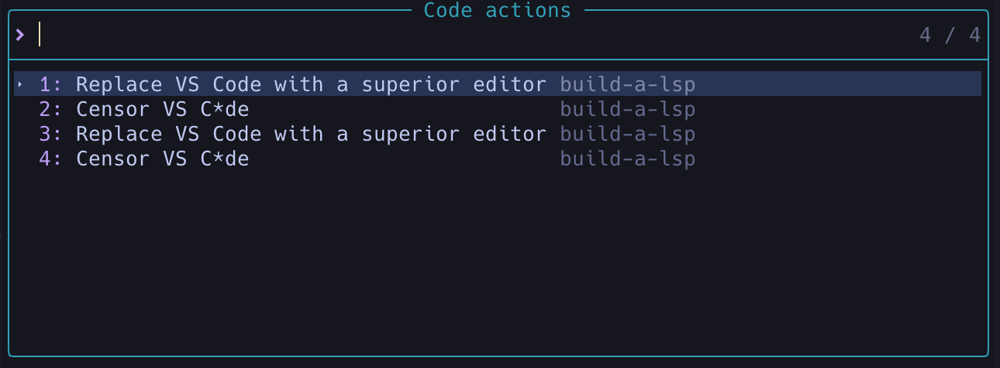
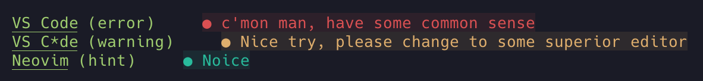

## Build a LSP with Go

A LSP for learning purpose.

[Learn By Building: Language Server Protocol](https://www.youtube.com/watch?v=YsdlcQoHqPY&t=6929s) by TJ.

[LSP protocol specification](https://microsoft.github.io/language-server-protocol/specifications/lsp/3.17/specification/)

## Capabilities

- Hover
- Go to definition
- Completion
- Code Actions
- Diagnostics

## Usage

With the superior editor neovim, of course.

### Setup

open init.lua or your own configs.

    $ go build main.go

Make sure cmd path is connected to built Go binary

```
vim.keymap.set("n", "K", vim.lsp.buf.hover)
vim.keymap.set("n", "gd", vim.lsp.buf.definition)
vim.keymap.set("n", "<leader>ca", vim.lsp.buf.code_action)

local client = vim.lsp.start_client({
  name = "build-a-lsp",
  cmd = { "PATH/build-a-lsp/main" },
})

if not client then
  vim.notify("hey, not good client")
  return
end

vim.api.nvim_create_autocmd("FileType", {
  pattern = "markdown",
  callback = function()
    vim.lsp.buf_attach_client(0, client)
  end,
})
```

### Hover (K)

Shows current path and character count.

      :lua vim.lsp.buf.hover()

### Go to definition (gd)

Go up one line and set cursor to the first character

      :lua vim.lsp.buf.definition()

### Completion

Completion for "Neovim (BTW)"


### Code Actions (\<leader\>ca)

Fix unwanted editor


      :lua vim.lsp.buf.code_action()

### Diagnostic

Show the wrong editors


### View logs

      $ less -f log.txt

### Eaxmples

After setup open this file LSP will work its magic with the examples

- Hover THIS
- Use code action to fix: VS Code (that seen right, use code action to fix it)
- Complete this: Neo
- Use go to definition to go up one line
- Diagnostics:

      VS Code (error)
      VS C*de (warning)
      Neovim (hint)
